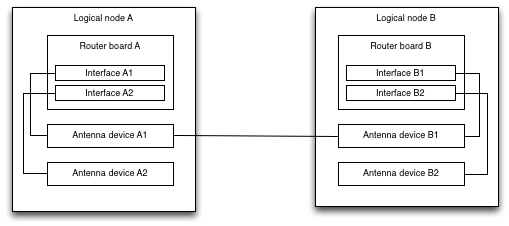

# CAAAS tutorial

## Supported input file
Currently the following input files describing the network are supported:
* GEXF

### GEXF

#### XML Structure

In this section we describe how the GEXF format describes the community network. A logical community node in the network consists of a number of routing boards and antenna devices, all located on the same site and interconnected with wires.  A logical node can thus be broken down in antenna devices and routing boards.  The antenna devices are used to let the interfaces of the routing boards on different logical nodes to communicate with each other and consist of a wired connection to the router board and a wireless connection to the antenna device of another logical node.  The routing boards them self are made up of multiple interfaces, combining multiple connections with other logical nodes on a single board.  Each interface has its own metrics such as transmitted packet count, link speed, ... . For this reason, the GEXF format is used as follows:

* Each routing board is an GEXF node.
* Each interface of the routing board is a GEXF node with the parent id equal to the id of its routing board.
* Each antenna device is a GEXF node.
* Each wired connection within the logical node, is a directed GEXF edge between the interface GEXF nodes.
* Each wireless connection between logical nodes, is a directed GEXF edge between the interface GEXF nodes.

Consider the following example.

This would result in the following GEXF file structure:

	<gexf>
		<graph>
			<nodes>
				<!-- logical node A -->
				<node id="11" label="Router board A"/>
				<node id="12" label="Interface A1" pid="11"/>
				<node id="13" label="Interface A2" pid="11"/>
				
				<node id="14" label="Antenna device A1"/>
				<node id="15" label="Antenna device A2"/>
				
				<!-- logical node B -->
				<node id="21" label="Router board B"/>
				<node id="22" label="Interface B1" pid="21"/>
				<node id="23" label="Interface B2" pid "21"/>
				
				<node id="24" label="Antenna device B1"/>
				<node id="25" label="Antenna device B2"/>
			</nodes>
			<edges>
				<!-- wired edges in logical node A -->
				<edge id="1" source="12" target="14"/>
				<edge id="2" source="13" target="15"/>
				
				<!-- wired edges in logical node B -->
				<edge id="3" source="22" target="24"/>
				<edge id="4" source="23" target="25"/>
				
				<!-- wireless edge between logical node A  and B -->
				<edge id="5" source="14" target="24"/>
			</edges>
		<graph>
	</gexf>

If the logical node graph is needed for certain metrics, first the nodes with the same PID should be joined together.  Also the edges should be rewritten to aim at the joined node for the routing boards. Then the wired edges can be merged into a single node. Also here the edges should be renamed.

#### Attributes
To store the additional information of the devices, the attributes defined by GEXF are used. None of the attributes are obligatory.  The attributes are not limited by the list given in this section.
Each GEXF node can have the following GEXF attributes:

* hardware: This field defines type of hardware, e.g. MikroTik, Ubiquiti.  This is used for the routing boards and antenna devices.
* access: This field describes how the information of the GEXF node is gathered, e.g. SNMP, MikroTik Api.
* IPs: The list of IPs found on the device. This field is only used for the routing boards.
* function: Defines the function of the GEXF node. This is only used for routing board interfaces and antenna devices.
* defaultgw: Provides the default gateway of the GEXF node. Only used for routing board interfaces and antenna devices.
* interface_name: The name of the interface. Only used for routing board interfaces and antenna devices.
* interface_rx: Gives the number of received bytes.
* interface_tx: Gives the number of transmitted bytes.
* interface_error: Gives the number of transmission errors encountered.

Not only the GEXF nodes have additional information, also the GEXF edges can hold extra information concerning the wired or wireless connections.  By defining the edges directed, the information of both 
Each GEXF edge can have the following GEXF attributes:

* type: The type of edge, e.g. wired, wireless, VLAN, ... .
* vlan: If the type is vlan, this field holds the vlan number.
* txrate: The current transmission rate of the connection.
* rxrate: The current receiving rate of the connection.
* frequency: If the type is wireless, the frequency is stored here.
* signalstrength: If the type is wireless, this field contains the signal strength.
* speedmin: The minimum speed of the link.
* speedavg: The average speed of the link.
* speedmax: The maximum speed of the link.
* discovered: Contains the type of algorithm the link was discovered with.

## Creating Python scripts for CAAAS

### Header
Each script should start with a header containing the title and description of the algorithm or data analysis preformed.

	#!/usr/bin/python
	#title Closeness centrality
	#descr Calculates the closeness centrality for each node

### Reading GEXF
NetworkX comes with a GEXF reader that can be used as follows.  The GEXF file is passed as the first argument

	import networkx
	import sys
	...
	G_orig = networkx.read_gexf(sys.argv[1],None,False)

### DeviceGraph and NodeGraph
As explained, the GEXF contains all the interfaces of the network.  Some analysis only need the logical node graph or the devices graph.  These two graphs can be created from the GEXF using the module 'group.py' and are called as follows.

	import group
	...
	G = group.nodeGraph(G_orig)
	G = group.deviceGraph(G_orig)

### Outputting results
Results of an analysis can be outputted to any file.  The analysis are execute in a workspace directory and any outputted files are considered results.  In case temporary files are needed, make sure they are removed before ending the script.
For our example, we output the node id and the closeness centrality value on a line:

	cc = networkx.closeness_centrality(G.to_undirected())
	with open("closeness_centrality.txt", 'w') as f:
    	for i in sorted(cc, key=cc.get, reverse=True):
        	f.write("%s %f\n" % (i, cc[i]));

